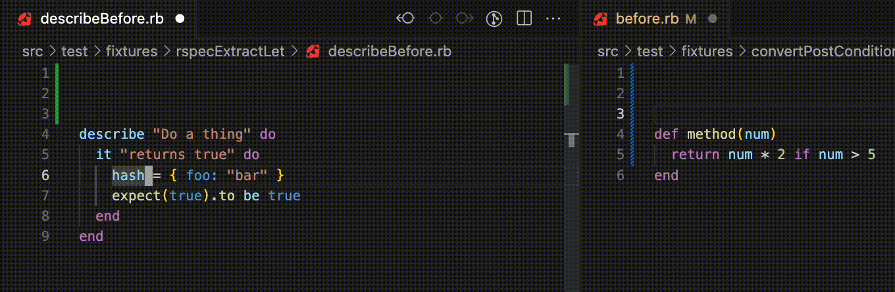

# vscode-ruby-refactoring

A port of [vim-ruby-refactoring](https://github.com/ecomba/vim-ruby-refactoring) for VSCode.

## Features

List of commands currently available:

- RSpec Extract Let
- Convert Hash Keys (current line or selection for multi-line hashes)
- Convert Post Conditional

Demo of current features:

### Roadmap

Features to be ported:

- [ ] Add Parameter
- [ ] Inline Temp
- [ ] Extract Constant          (visual selection)
- [ ] Extract Local Variable    (visual selection)
- [ ] Rename Local Variable     (visual selection/variable under the cursor)
- [ ] Rename Instance Variable  (visual selection)
- [ ] Extract Method

## Release Notes

### 0.1.0

Initial release of vscode-ruby-refactoring with initial features:

- RSpec Extract Let
- Convert Hash Keys (current line or selection for multi-line hashes)
- Convert Post Conditional

---
